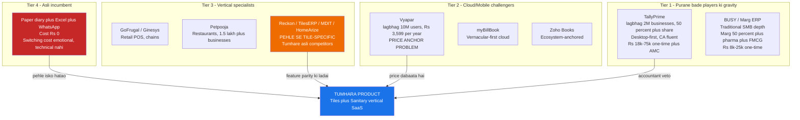
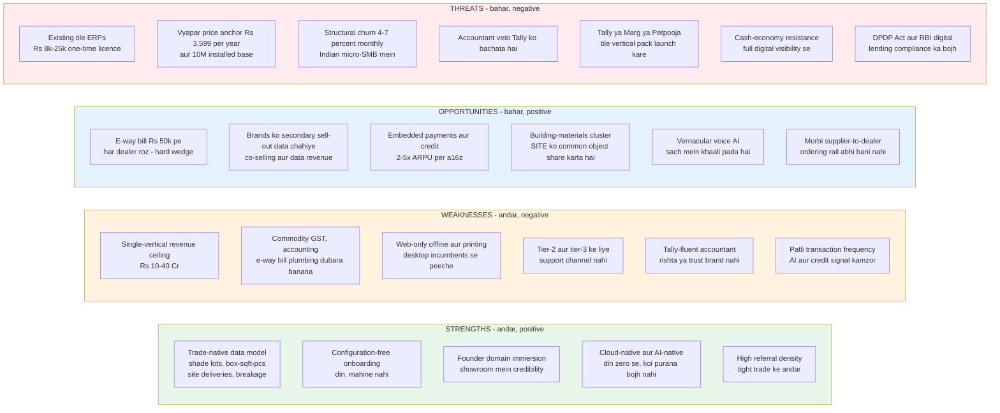
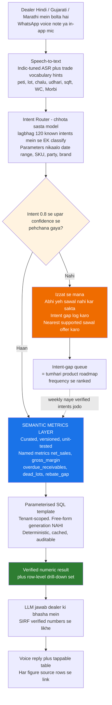
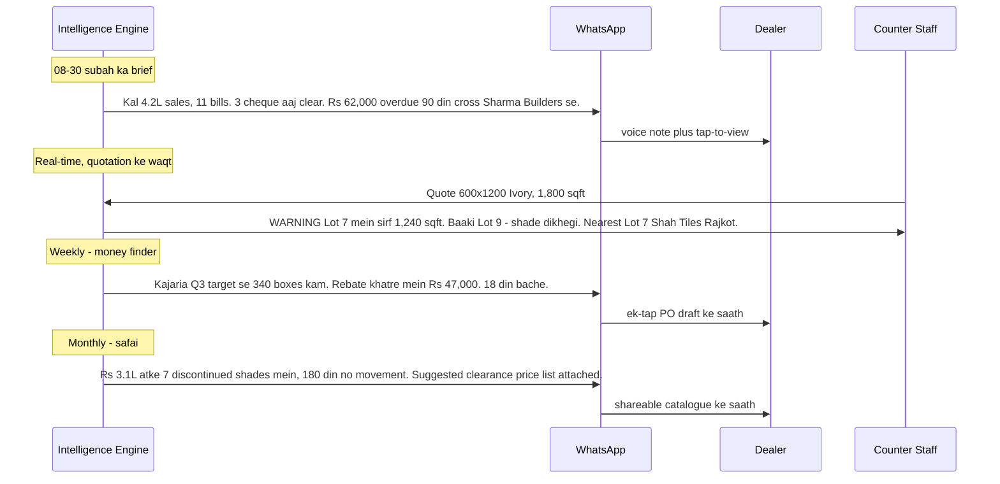
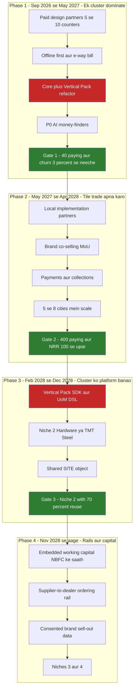
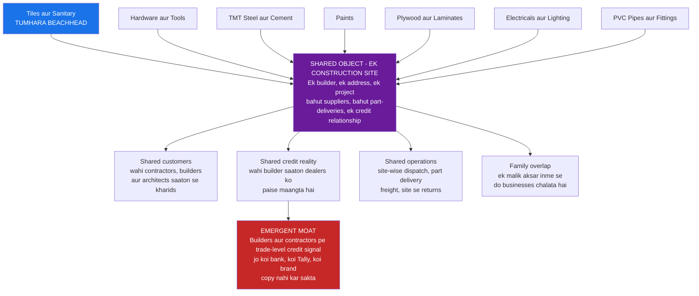
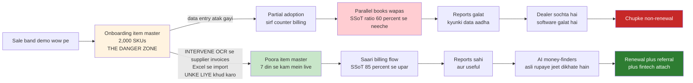

# Strategic Audit (Hinglish, simple words): India ke local dukaan walon ke liye hyper-niche retail SaaS

### Beachhead (pehle wala target market): Tiles aur Sanitaryware (bathroom fittings) ke dealers
### Model: Is trade ke hisaab ka stock, billing, udhari, aur AI analytics

**Document kis type ka hai:** Strategic audit aur operating plan — matlab company ka seedha, sachcha review + kaise chalana hai, yeh plan.
**Kis nazar se likha gaya:** Strategic Business Consultant / SaaS Product Architect ki review.
**Analysis ki date:** August 2026

**Yeh file kya hai:** Original English audit ka **poora** Hinglish translation. Koi fact, number, company naam, table, diagram, gate, checklist ya source miss nahi kiya. Sirf bhasha simple Hinglish hai.

---

## Pehle yeh 50+ short forms samajh lo (full form + matlab)

Neeche jo short form aati hai, woh pehle yahan ek baar padh lo. Document mein pehli baar dubara bhi simple shabdon mein likha hai.

| Short form | Full English naam | Simple Hinglish matlab |
|---|---|---|
| **SaaS** | Software as a Service | Software jo aap **rent** pe lete ho (mahine/saal ka fees). Computer pe ek baar kharid ke rakhna nahi — jaise Netflix, waise dukaan ka software. |
| **ERP** | Enterprise Resource Planning | Poora dukaan chalane wala software: stock, billing, hisaab, GST, udhari — ek jagah. Tally bhi isi family ka hai, lekin generic (har trade ke liye ek jaisa). |
| **POS** | Point of Sale | Counter pe bill kaatne wala system. |
| **AI** | Artificial Intelligence | Computer jo sawal samajh ke jawab de, pattern dekhe, suggestion de. ChatGPT jaisa dimaag, lekin yahan dukaan ke numbers pe. |
| **LLM** | Large Language Model | Woh bada AI model jo insaan ki bhasha padhta/likhta hai (ChatGPT, Gemini). **Yahan rule:** LLM kabhi khud hisaab nahi karega — sirf baat samjhega aur jawab bolega. |
| **TAM** | Total Addressable Market | India mein **kitne total** tile/sanitary counters theoretically aapke customer ho sakte hain. Sabse bada circle. |
| **SAM** | Serviceable Available Market | TAM mein se woh hisse jo **sach mein** aapke product ke layak hain (GST registered, computer hai, turnover theek hai). |
| **SOM** | Serviceable Obtainable Market | SAM mein se **realistic** kitne aap agle 5 saal mein jeet sakte ho. Sapna nahi, haath mein aane wala hissa. |
| **ARR** | Annual Recurring Revenue | Har saal **dobara aane wali** income (subscription). Ek baar ka licence isme nahi ginta. |
| **ARPU** | Average Revenue Per User | Ek customer se average kitna paisa saal/mahine mein. |
| **GMV** | Gross Merchandise Value | Dealers kitna maal **bechte** hain (unke sales ka volume). Fintech is GMV pe scale karta hai, seat count pe nahi. |
| **CAC** | Customer Acquisition Cost | Ek naya paying customer lane ka **poora** kharcha (ads, salesman, founder time, onboarding). |
| **NRR** | Net Revenue Retention | Purane customers se agle saal kitna revenue bacha + badha (upsell, extra counter, payments) minus jo chhod gaye. **100% se upar** matlab existing customers se revenue badh raha hai. |
| **Churn** | Customer churn | Kitne customers software chhod dete hain. **Logo churn** = kitne **accounts** gaye (paisa nahi, dukaan ki ginti). **Monthly churn** = har mahine kitne % nikal gaye. |
| **Gross revenue retention** | (same) | Purane customers ka revenue kitna **bacha** (expansion ke bina). Vertical SaaS mein ~91%, generic mein 78–85%. |
| **YoY** | Year over Year | Is saal vs pichle saal. |
| **ROI** | Return on Investment | Software pe kharcha vs usse kitna fayda / nuksaan bacha. |
| **SMB** | Small and Medium Business | Chhoti-medium dukaan/company. **Micro-SMB** = bahut chhoti dukaan. |
| **Vertical SaaS** | Vertical = ek trade | Sirf ek trade (tiles) ke liye bana software. **Horizontal** = har trade ke liye generic (Tally, Vyapar). |
| **Beachhead** | Pehla jeeta hua market | Pehle tiles/sanitary jeeto, phir aas-paas ki trades. Fauj pehle ek beach pakadti hai, phir aage badhti hai — wahi idea. |
| **Moat** | Khandaq / defensible advantage | Woh cheez jo competitor copy nahi kar sakta asani se (channel, data, aadat, paisa ki movement). Feature list moat nahi hoti. |
| **Wedge** | Pehle andar ghusne ka kona | Jis cheez se dealer pehle software lena shuru kare (jaise e-way bill, shade-lot warning). Wedge se andar aao; moat baad mein banti hai. |
| **GTM** | Go-to-Market | Product ko customers tak kaise pahunchana — sales, partners, brands. |
| **SWOT** | Strengths, Weaknesses, Opportunities, Threats | Andar ki taqat/kamzori + bahar ke mauke/khatre. |
| **GST** | Goods and Services Tax | India ka sales tax. |
| **GSTIN** | GST Identification Number | Har registered business ka GST number. Ek dealer ke kai GSTIN ho sakte hain (kai branches). |
| **AATO** | Aggregate Annual Turnover | GST ke hisaab se kitna saal ka turnover. E-invoice isi pe lagta hai. |
| **FY** | Financial Year | Hisaab ka saal (India mein April–March). |
| **B2B** | Business to Business | Dealer se builder/contractor ko sale. |
| **B2C** | Business to Customer | Counter pe seedha ghar wale ko sale. |
| **SEZ** | Special Economic Zone | Export-type zone; e-invoice yahan bhi B2B/export jaisa lagta hai. |
| **IRN** | Invoice Reference Number | GST e-invoice ka unique number. Government portal se milta hai. |
| **E-invoice** | Electronic invoice | Bade turnover pe B2B bill government ko digitally report. |
| **E-way bill** | Electronic way bill | Maal truck mein le jaane ka digital permit. **Rs 50,000 se upar** consignment pe lagta hai. |
| **HSN** | Harmonized System of Nomenclature | Har item ka tax code (tiles ka alag, WC ka alag). |
| **CGST / SGST / IGST** | Central / State / Integrated GST | Same state sale = CGST+SGST; doosre state = IGST. |
| **RCM** | Reverse Charge Mechanism | Kabhi buyer tax bharta hai, seller nahi — GST rule. |
| **GSP** | GST Suvidha Provider | Government-approved company jiske through software e-invoice/e-way bill bhejta hai. |
| **TDS** | Tax Deducted at Source | Payment se tax kaatna. Referral commission pe **Section 194H** lag sakta hai. |
| **CA** | Chartered Accountant | Dealer ka hisaab-kitab aur GST filing wala accountant. |
| **AMC** | Annual Maintenance Contract | Software kharidne ke baad har saal ka maintenance fees (Tally wala model). |
| **UPI** | Unified Payments Interface | PhonePe/GPay/BHIM se turant payment. |
| **PDC** | Post Dated Cheque | Aane wali date ka cheque. |
| **SKU** | Stock Keeping Unit | Har alag item-code (600x1200 Ivory Kajaria = ek SKU). |
| **UoM** | Unit of Measure | Napne ki unit: box, piece, sqft, kg, litre. |
| **BOM** | Bill of Materials | Set ke andar kaunse parts (WC = pan + cistern + seat + fittings). |
| **GRN** | Goods Receipt Note | Supplier se maal aate hi stock mein entry. Lot number yahi pe lagna chahiye. |
| **OCR** | Optical Character Recognition | Photo/PDF bill se computer khud text/numbers nikaale. |
| **WC** | Water Closet | Toilet / commode. |
| **RBAC** | Role-Based Access Control | Owner, salesman, loader — har kisi ko alag permission. |
| **PWA** | Progressive Web App | Website jo phone pe app jaisi install ho. |
| **WASM** | WebAssembly | Browser ke andar fast program (SQLite jaise database chalane ke liye). |
| **SQLite / IndexedDB** | (database names) | Phone/computer pe **local** data rakhne wale stores — offline billing ke liye. |
| **SQL** | Structured Query Language | Database se numbers nikalne ki language. Yahan templates ready rahenge, AI khud SQL nahi likhega. |
| **ASR** | Automatic Speech Recognition | Awaaz ko text banana (Hindi/Gujarati voice note). |
| **TTS** | Text to Speech | Text ko awaaz banana (dealer ko voice reply). |
| **NLG** | Natural Language Generation | Verified numbers se seedhi bhasha mein jawab banana. |
| **CI** | Continuous Integration | Har code change pe automatic tests. AI ke numbers galat na hon, isliye. |
| **NPS** | Net Promoter Score | Customer kitna recommend karega (0–100). 50 se upar strong. |
| **MoU** | Memorandum of Understanding | Do companies ke beech likha hua agreement (brand ke saath). |
| **NBFC** | Non-Banking Financial Company | Bank nahi, lekin loan de sakti hai (Bajaj Finance jaisi). RBI ke rules. |
| **RBI** | Reserve Bank of India | India ka central bank. Digital lending ke rules yahi banata hai. |
| **DLG** | Default Loss Guarantee | Platform loan pe kitna nuksaan apne sar pe le — RBI ne cap rakha hai (**abhi portfolio ka 5%**). |
| **KFS** | Key Fact Statement | Loan ke saath zaroori facts ka paper — RBI maangta hai. |
| **DPDP Act** | Digital Personal Data Protection Act, 2023 | India ka data protection kanoon. Dealer aur unke customer ka data — consent, purpose, breach notice, grievance officer. |
| **DSO** | Days Sales Outstanding | Bill kaatne ke baad **kitne din** mein paisa aata hai. Ironi: aapke udhari wale customers aapko bhi udhari denge. |
| **SSoT** | Single Source of Truth | Dukaan ka **asli** hisaab sirf aapke software mein. Ratio = aapke app ke sales ÷ asli GST turnover. |
| **FMCG** | Fast Moving Consumer Goods | Sabun, biscuit jaisa tez bikne wala maal. Marg ERP yahan strong hai. |
| **CAGR** | Compound Annual Growth Rate | Market kitni % se compound hoke badh raha hai. |
| **SDK** | Software Development Kit | Nayi vertical pack banane ka toolkit — core code copy-paste nahi. |
| **DSL** | Domain Specific Language | Chhoti config language jisse pack declare ho (units, lots) — naya fork nahi. |
| **OS (trade OS)** | Operating System | Yahan matlab: building-materials trade ka **poora chalane wala system**, sirf ek app nahi. |
| **Fork** | Code ki nakal / alag copy | Har niche ke liye alag codebase. **Yahi #1 marne ka tarika** multi-niche ka. |
| **Core + Vertical Pack** | (architecture) | 70–80% code **ek baar** (GST, ledger, e-way). 20–30% har trade ki pack (tiles shade-lot). Nayi trade = nayi pack, core nahi. |
| **P0 / P1 / P2 / P3** | Priority 0, 1, 2, 3 | P0 = abhi banao (jaan hai). P3 = baad mein. |
| **Design partner** | Pehle wale paying testers | 5–10 dealers jo **paise deke** product shape karte hain. Free nahi. |
| **a16z** | Andreessen Horowitz | America ki badi venture capital firm. Unka research: fintech jodne se per-customer revenue 2–5x. |
| **VC** | Venture Capital | Investors jo growth ke liye paisa dete hain. |
| **Payback (CAC payback)** | Kitne mahine mein CAC wapas | Fully-loaded CAC ÷ monthly gross profit. 12 mahine se kam = healthy. |
| **Gross margin** | (sales − cost) / sales | Software bechne ke baad kitna % bacha (AI kharcha, support katne ke baad). |
| **Seat-based pricing** | Per login fees | Har user ka alag charge. Dealer ek login share karte hain — audit toot jata hai. Isliye **counter/godown/GSTIN** se tier karo. |
| **Float vs integer** | Decimal vs poora number | Computer 0.1 ko exact nahi rakhta (float). Sqft float mein rakhoge to bill galat. **Integer pieces** + conversion factor. |
| **Multi-tenant** | Kai dukaan ek software mein | Har shop ka data alag. Leak = company khatam, kyunki trade mein sab ek doosre ko jaante hain. |
| **Row-level security** | Database pe tenant lock | Query layer pe shop_id filter — sirf app pe bharosa nahi. |
| **CSCs (CERA)** | Style Centres (CERA ke retailer-owned centres) | CERA ke 1,613 Style Centres + 1,400+ aur planned. |
| **CBIC** | Central Board of Indirect Taxes and Customs | GST rules notify karti hai. |
| **194H** | Income-tax section | Commission/brokerage pe TDS. Plumber/architect referral payout ke liye. |

**Do aur simple ideas (short form nahi, lekin document bhar use hue):**

- **System of record** = dukaan ka asli register. Jo yahan likha, wahi sach.
- **Embedded finance / fintech attach** = software ke andar hi UPI, collections, baad mein loan. Alag app nahi.
- **Configuration-free** = consultant baithake setup nahi; tiles ka data model pehle se bana hua.
- **Offline-first** = bijli/net kate to bhi bill chale. Cache nahi — pehle local, phir sync.
- **Vernacular** = Hindi, Gujarati, Marathi — English typing nahi.
- **Cluster strategy** = tiles ke baad hardware, steel, paint — sab building materials, scattered kirana/salon nahi.

---

## Table of Contents

1. [Executive Summary — seedha faisla](#1-executive-summary--seedha-faisla)
2. [Market kitna viable hai](#2-market-kitna-viable-hai)
3. [Niche-first ke faayde aur nuksaan, gehraai se](#3-niche-first-ke-faayde-aur-nuksaan-gehraai-se)
4. [SWOT analysis](#4-swot-analysis)
5. [AI ko kaise jodna hai](#5-ai-ko-kaise-jodna-hai)
6. [Go-to-Market aur scaling ka roadmap](#6-go-to-market-aur-scaling-ka-roadmap)
7. [Critical watch-list — roz dekho](#7-critical-watch-list--roz-dekho)
8. [Expert recommendations](#8-expert-recommendations)
9. [Kill criteria aur decision gates](#9-kill-criteria-aur-decision-gates)
10. [Agle 90 din ki validation checklist](#10-agle-90-din-ki-validation-checklist)
11. [Sources aur evidence](#11-sources-aur-evidence)

---

## 1. Executive Summary — seedha faisla

### Verdict: **Conditional Go — lekin jo thesis abhi likhi hai, usme ek badi galat samajh hai.**

Niche-first instinct **sahi** hai, aur data bhi support karta hai. Jo **wajah** tumne di hai, woh galat hai.

Tumne moat (lamba protection) yeh mana hai: **product specificity** — "hum tile-specific unit conversion, hardware-specific measurement banayenge, isliye generic Tally ko hara denge." Yeh moat **pehle hi khatam** ho chuki hai. India mein **kam se kam paanch** vendors aaj hi tile-aur-sanitary-specific software bechte hain, bilkul wahi features advertise karke jo tum describe karte ho — box/piece/sqft auto-conversion, multi-godown stock, damage tracking, size/shade/finish variants, quotation se invoice. **Reckon (Lucknow), Altrelic TilesERP, MicroDream MDIT, HomeArize,** aur kai regional (shehar ke) dev shops isi jagah pe hain. Zyadatar **one-time licence** bechte hain **Rs 8,000–Rs 25,000** mein — yeh structurally (banawat se) subscription model ka dushman hai.

Isliye sachcha competition picture yeh nahi: "tum vs Tally." Yeh hai:

> **Tum vs Tally ka accountant lock-in, vs Vyapar ka Rs 3,599/saal price anchor, vs ek dozen regional tile-ERP shops jinke local rishte pehle se hain, vs incumbent Excel + diary system jiska kharcha zero hai.**

Tumhari thesis ka **bachaaya ja sakne wala** version alag hai, aur **zyada strong**:

> **Vertical specificity (trade-specific cheezein) wedge hai, moat nahi. Moat yeh hai: (a) dealer ke har transaction ka ek hi sachcha source banna, (b) us sach ke upar paisa ki movement (payments/credit) apne haath mein lena, aur (c) aisi distribution machine banana jo tier-2/3 counters tak kisi se sasta pahunche.**

Evidence ki India mein **bilkul isi shape** mein yeh kaam karta hai:

| Company | Vertical wedge (andar ghusne ka kona) | Moat aakhir kahan bani |
|---|---|---|
| **Marg ERP** | Pharma distribution (Schedule H/H1 dawai, batch, expiry date) | Pharma aur FMCG trade ka **50% se zyada** share, FY25 revenue **Rs 95.4 Cr**, **850+ local support centres**, ab PayU se payments/reconciliation embed kar rahe hain |
| **Petpooja** | Restaurant POS — neeche ke 90% restaurants, fine dining nahi | **1,50,000+** businesses, FY24 revenue **Rs 77.2 Cr** at **43% YoY** growth, **200+ integrations**, payroll/retail mein expand |
| **Tally** | Generic accounting, lekin **CA channel** apna kiya | ~**2 million** businesses, **50%+** share, **30+ saal** se defend — features se nahi, accountant ki fluency se |

Note karo teenon mein kya common hai: tikne wala asset **channel aur workflow mein ghusna** hai, feature set ki cleverness nahi.

### Is poori audit ka sabse important number

Neeche se (bottom-up) model (§2 mein detail) kehta hai: **sirf Tiles aur Sanitaryware niche** ke software-only revenue ka realistic ceiling lagbhag **Rs 10–14 Cr ARR** hai. **Rs 25–40 Cr** tabhi jab payments aur credit upar layer karo.

Iska hard strategic matlab: **multi-niche expansion "future phase" nahi hai — business model ki structural zaroorat hai.** Matlab agle **cheh mahine** ke architecture decisions — jab abhi ek hi vertical hai — decide karenge company scale pe zinda rahegi ya nahi. Tiles app ko standalone bana ke "baad mein doosri niches pe jump" **sabse high-probability failure mode** hai, kyunki niche #2 fork banegi, aur niche #4 tak tum **services company** ban jaoge — ek team, char codebases maintain.

### Verdict scorecard

| Dimension | Rating | Reasoning (simple) |
|---|:--:|---|
| Problem reality | **9/10** | Tile/sanitary dealers sach mein shade-lot tracking, sqft conversion, site deliveries, breakage, udhari pe dukhi hain. Tally inme se kuch model nahi karta. |
| Uniqueness of insight | **4/10** | Niche tile ERPs pehle se hain. Insight common hai; execution aur distribution alag karti hai. |
| TAM per niche | **5/10** | ~**22,462** bathroom supply stores India mein (May 2026); tile counters alag. Real hai, lekin ek-niche business **low tens of crores** pe cap. |
| Willingness to pay | **6/10** | Kirana se zyada (ticket size **Rs 50k–Rs 5L**, isliye software ka ROI dikhaya ja sakta hai), lekin one-time-licence competitors neechi price pe kheenchte hain. |
| Churn risk | **4/10** | Indian micro-SMB SaaS structurally **4–7% monthly** churn karti hai. Vertical SaaS isko kam karta hai (**91%** gross retention vs horizontal **78–85%**) lekin khatam nahi karta. |
| Moat potential | **7/10** | Strong **agar** system-of-record + embedded finance + local channel mil jaaye. Weak agar sirf feature-differentiated app raho. |
| AI as differentiator | **3/10 aaj → 8/10 agar re-architect** | "Apne data se chat" bot **demo** hai, moat nahi. Proactive vernacular voice intelligence moat hai. Dekho §5. |
| Founder-market fit requirement | **Critical** | Yeh business **showroom mein baith ke** jeeti jaati hai, code likh ke nahi. |

**Overall: aage badho, lekin teen commitments ke around restructure karo** — (1) din ek se **Core + Vertical Pack** architecture, (2) **cluster strategy** (building materials) scattered niches nahi, (3) revenue model jo shuru se **payments/credit** plan kare, sirf subscription nahi.

---

## 2. Market kitna viable hai

### 2.1 Indian retail software landscape — jisme tum actually ghus rahe ho

**Teen landscape facts jo plan badal dene chahiye:**

1. **Tumhara primary competitor diary hai, Tally nahi.** Zyadatar tile counters jinka turnover **Rs 5 Cr se neeche** hai, Tally **sirf CA ke GST filing** ke liye chalate hain. Asli business diary, WhatsApp group, aur malik ki memory pe chalta hai. Tum software migration nahi kar rahe; **behaviour change** kar rahe ho. Behaviour change ke liye onboarding services chahiye, sirf features nahi.

2. **Accountant ke paas veto power hai.** Dealer ka CA Tally-fluent hai, aur jo cheez unka filing workflow todegi usko resist karega. Isliye **saaf Tally/BUSY export Day-1 ki zaroorat hai, roadmap item nahi.** Position yeh rakho: "yeh shop-floor system hai jo tumhare CA ke Tally ko feed karta hai" — "Tally replacement" nahi. Pehle saal Tally replace karne ki koshish veto trigger karegi aur woh deals mar jaayengi jo otherwise jeet sakte the.

3. **Vyapar ne price well ko Rs 3,599/saal pe zeher de diya hai.** Uske against price argument jeet nahi sakte. **Category** argument jeetto: "Vyapar billing app hai. Yeh tumhare showroom ka operating system hai — ise shade lots, site deliveries, breakage claims, aur tumhara Kajaria rebate target pata hai." Alag category, alag budget line, alag price.

### 2.2 Beachhead ka bottom-up TAM

Public counts perfect nahi, isliye inhe **validate karne wala model** samjho, final finding nahi. Anchor: **22,462 bathroom supply stores India mein May 2026 tak**, Maharashtra (~**2,084**) aur Uttar Pradesh (~**1,928**) mein concentrate. Tile-only retailers alag count hote hain, aur kai counters combined tile-plus-sanitary showroom hain.

| Layer | Assumption | Count | Notes |
|---|---|---:|---|
| **TAM** — India ke saare tile aur/ya sanitaryware retail counters | Bathroom supply ~22.5k + tile retail counters, combined showrooms ko ek baar count (dedupe) | **60,000 – 100,000** | Brand dealer lists se validate karna zaroori |
| **SAM** — GST-registered, turnover **≥ Rs 1 Cr**, **≥1 computer**, malik 50 se kam umar ya beta/beti business mein | TAM ka ~**30%** | **18,000 – 30,000** | Yahi asli gate hai; Rs 1 Cr ke neeche pay karne ki **ability aur willingness** dono gir jaati hain |
| **SOM (5 saal, aggressive)** | SAM ka **20%** | **4,000 – 6,000 accounts** | 5 saal mein vertical ka 20% share pehle se strong outcome hai |
| **Software ARR at Rs 24,000 blended ARPU** | | **Rs 10 – 14 Cr** | ARPU multi-counter / multi-GSTIN tiering maanta hai |
| **+ Payments aur credit at 2–3x ARPU uplift** | a16z: fintech attach per-customer revenue **2–5x** badhata hai | **Rs 25 – 40 Cr** | §8 wala fintech layer chahiye |

**Interpretation.** Ek vertical **Rs 10–40 Cr ARR** wala business hai — accha, fundable, profitable company, lekin **Rs 100 Cr+** nahi. Sobering benchmark: **koi bhi India-market SMB SaaS company sirf domestic SMB pe Rs 100 Cr ARR cross nahi kari.** Rs 100 Cr ke liye ya to **5–8 verticals**, ya fintech/data layer jo dealer ke **GMV** (unke sales volume) ke saath scale kare seat count ke saath nahi, ya dono.

### 2.3 "Niche vs generic" bet directionally sahi kyun hai

Poori argument **retention ke hisaab** pe khadi hai:

| | Horizontal SMB SaaS (generic) | Vertical SaaS (ek trade) | Fintech-led Vertical SaaS (saath mein payments/loan) |
|---|:--:|:--:|:--:|
| Gross revenue retention | 78–85% | ~91% | ~96% |
| Monthly churn | 3–7% | kam | sabse kam |
| Annualised logo churn | 31–58% | — | — |

Horizontal SMB platform ko **har saal apni customer base ka ek-tihai se zyada replace** karna padta hai sirf flat rehne ke liye. Yahi treadmill ne kiranatech cohort ko maara. Vertical depth **ek hi known lever** hai jo SMB software ke liye yeh equation badalti hai, kyunki configuration-free fit se time-to-value **mahine nahi, din** hote hain, aur switching cost workflow specificity ke saath badhta hai.

Caveat usi vertical-SaaS research se: sabse acchi opportunity wali verticals mein **teen traits** hote hain — legacy/paper workflows, high transaction volume jisse embedded payments chale, aur itni domestic depth ki scale ho. Tiles aur sanitaryware **paper workflows pe accha** (excellent), **transaction volume pe medium** (ticket size bada, lekin transaction **frequency** kam — yeh AI aur lending ke liye bahut matter karta hai, dekho §5.4 aur §8.3), aur **standalone depth pe kamzor** (isliye §6 ki cluster strategy).

### 2.4 Compliance ki asliyat jo tumhe hard wedge deti hai

Do thresholds matter karte hain, aur log priority ulti rakhte hain:

| Requirement | Threshold | Tile dealer ke liye relevance |
|---|---|---|
| **GST e-invoicing (IRN)** | Aggregate turnover **> Rs 5 Cr** kisi bhi FY mein 2017-18 se (ek baar cross kiya to **hamesha**); sirf B2B/export/SEZ, B2C nahi | Sirf **bade** dealers pe. **Rs 2 Cr** tak reduction propose hua hai lekin notify nahi — watch karo |
| **E-way bill** | Consignment value **> Rs 50,000**, turnover se farq nahi | **Har dealer, har din, tiles ke almost har truckload pe** |

**Strategic read:** e-way bill generation tumhara **sabse high-frequency, sabse zyada dard** wala compliance hook hai — tiles ka tempo trailer hamesha Rs 50,000 se upar, validity roughly **200 km pe 1 din**, naye **2026 limits** (180 din se purane invoice pe e-way bill nahi; total validity **360 din** cap). Delivery challan se e-way bill auto, loading bay pe vehicle number capture — yeh feature dealers **turant paise deke, roz** use karenge. Isko **e-invoicing se upar** priority do.

---

## 3. Niche-first ke faayde aur nuksaan, gehraai se

### 3.1 Pros — aur har ek ke peeche specific mechanism

**P1. Demo se close conversion tez badhti hai kyunki tum trade ki bhasha bolte ho.**
Jab tum "shade lot" kehte ho "batch number" ki jagah, "peti" kehte ho "carton" ki jagah, aur screen dikhati hai *"Lot 7 mein sirf 42 boxes bache, is site ko 60 chahiye, agla lot doosri shade ka hai"* — teen mahine ka trust-building skip ho gaya. Niche approach ka **sabse bada** faayda yahi hai, aur yeh real hai. Generic ERPs yeh demo **literally nahi** kar sakte.

**P2. Configuration-free onboarding time-to-value ko mahine se din mein dabata hai.**
Tally/GoFrugal implementations mein consultant units, item masters, tax classes model karta hai. Tumhara product trade ka data model **pre-built** ship karta hai: standard sizes ke sqft-per-box tables (**300×300, 600×600, 600×1200, 800×1600**), standard sanitaryware sets, standard wastage percentages. Onboarding cost tumhara **sabse bada hidden CAC** piece hai (dekho §7) — yahan niche depth financially khud ka kharcha nikalti hai.

**P3. Ek trade ke andar word-of-mouth density bahut high hai.**
Shehar ke tile dealers ek doosre ko jaante hain; same Morbi suppliers se kharids, same dealer association meetings, same brand ke dealer WhatsApp groups. Niche mein ek khush customer **kai referrals** ke barabar. Generic market mein ek khush customer **zero** ke barabar kyunki agla prospect doosri trade mein hai. **Yahi niche-first ka sabse bada CAC advantage hai — referral loop jaan-bujh ke banao, ummeed mat karo.**

**P4. Brand channels distribution asset ban jaate hain.**
**CERA** akele: **272** dealer-owned Style Galleries, **292** Style Hubs, **1,613** retailer-owned Style Centres, **1,400+** aur planned. Kajaria, Somany, Jaquar, Hindware comparable networks chalati hain. Yeh brands **desperately** dealers se secondary sell-out data (dealer ne aage kya becha) chahte hain, aur abhi almost kuch nahi hai. Isse co-marketing aur shayad co-funding conversation milti hai jo koi horizontal player nahi kar sakta. (Dekho §8.5.)

**P5. Category redefine karke pricing power.**
Tum **ledger** nahi, **workflow** replace karte ho, isliye Vyapar ke subscription se nahi, **galti ke nuksaan** se compete karte ho. 2,000 sqft site pe galat shade-lot delivery = **Rs 40,000–Rs 1,50,000** nuksaan + builder relationship tootna. Uske against **Rs 30,000/saal** chhota hai. Niche depth se yeh argument credibly bannta hai.

**P6. Support sasta aur compounding ho jata hai.**
Jo support team sirf tiles jaanti hai, woh bahut jaldi bahut acchi ho jaati hai. Ticket resolution time girta hai, support transcripts product ka requirements document ban jaate hain. Generic product mein support knowledge compound nahi hoti kyunki har customer ki problem unique hoti hai.

### 3.2 Cons — aur har ek kitna severe hai

**C1. 80/20 ulta: boring 80% pe paisa kharch hota hai. [SEVERITY: HIGH]**
Lagbhag **80%** jo tile dealer ko chahiye, woh commodity infrastructure hai — GST calculation, e-way bill, e-invoice, returns/credit notes, double-entry accounting, ledgers, bank reconciliation, TDS, multi-GSTIN, audit trail, backups, roles. Sirf ~**20%** tile-specific hai. **Niche differentiator sasta hissa hai; undifferentiated plumbing mehnga hissa hai.** Aur har nayi vertical ke liye woh plumbing dubara banana/verify karna padega jab tak architecture rok na de. Yahi failure mode #1 ka seedha kaaran hai (dekho §7.4).

**C2. TAM ceiling expansion force karta hai usse pehle ki tumne kamaaya ho. [SEVERITY: HIGH]**
§2.2 se, ek niche **Rs 10–40 Cr** pe cap. Pressure aayega niche #2 launch karne ka around **300–500 customers** — bilkul jab support aur product teams sabse stretched hon. Jaldi expand = focus toot; late expand = company cap. Yeh timing years 2–3 ka **central executive judgement** hai.

**C3. Niche-specific competitors pehle se hain aur one-time licence pe bechte hain. [SEVERITY: MEDIUM-HIGH]**
Reckon, TilesERP, MDIT, HomeArize aur regional shops pehle se advertise karte hain: box/piece/sqft conversion, multi-godown stock, damage-to-non-saleable conversion, shade variants. Kai **perpetual licences Rs 8k–Rs 25k**. Dealer "Rs 15,000 ek baar" vs "Rs 30,000 har saal" compare karega — features table nahi, **ROI story** chahiye. **Ek sentence mein bata sako kyun tum 2x price annually worth ho. Agar woh sentence features pe hai, haaroge.** Paisa jo dealer kamaye ya nuksaan rokhe, uspe hona chahiye.

**C4. Accountant veto aur Tally gravity. [SEVERITY: MEDIUM-HIGH]** — Day 1 pe Tally/BUSY export se mitigate; position complementary, replacement nahi.

**C5. Trust, dual books, aur tax wala sawal. [SEVERITY: HIGH — aur aksar unbolta]**
Indian local retail ka meaningful hissa unrecorded cash pe bhi chalta hai. Software jo sab dikha de, **fayda nahi, risk** lagta hai. Khatabook ke post-mortems yeh clearly kehte hain: shopkeepers traditional records isliye pasand karte the kyunki digital records trackable feel hote hain.

Sales meetings mein pucha jaayega parallel unrecorded books support karo. **Guidance: tax-evasion tooling mat banao.** Illegal hai, regulated finance ya institutional money chhoote hi existential liability, aur woh data asset khatam jo poori AI aur lending thesis pe depend karti hai. Jo **legally** bana sakte ho: proper quotation/estimate documents, proforma invoices, cash-sale handling, saaf B2C counter-sale flow — yeh sab kanooni hain aur zyadatar asli workflow cover karte hain. Phir incentive ghumaao: **"complete records se working capital 14% pe milta hai, local financier ke 30% ki jagah."** Transparency ko financing benefit banana is objection ka **ek hi tikne wala jawab** hai — aur yeh embedded-finance layer ka ek aur argument hai.

**C6. Web-only tier-2/3 mein operational risk. [SEVERITY: HIGH]**
Power cuts, patchy net, loading bay pe Wi-Fi nahi, dot-matrix printers jo abhi bhi challan **triplicate** print karte hain. Incumbents "100% offline" pe jeette hain. Pure web app jo truck gate pe wait kare aur spinner dikhaye, uninstall ho jaayegi. **Is market mein offline-first nice-to-have nahi; table stakes hai.** Dekho §8.2.

**C7. Tier-3 India mein support economics. [SEVERITY: MEDIUM]**
Marg apni base ko **850+ sales aur support centres** se sambhalta hai. Tally partner channel chalata hai. Rajkot, Hubli, Gorakhpur ko ek shehar ke ek office + phone line se nahi sambhal sakte. Channel plan karo, ya geography cap plan karo.

**C8. Kam transaction frequency AI aur lending signal dono kamzor karti hai. [SEVERITY: MEDIUM]**
Tile dealer din mein **10–30** invoices kaat sakta hai; restaurant **300**. Embedded-finance research clearly kehti hai: **roz, high-cadence** transaction data se platform underwriting bank statement se better hoti hai. Tumhara data **har record pe zyada valuable** hoga (bade tickets, named counterparties, credit terms) lekin **volume kam**. Underwriting **receivables quality** aur supplier se purchase-side data pe design karo, transaction count pe nahi.

---

## 4. SWOT analysis

**SWOT** = Strengths (andar ki taqat), Weaknesses (andar ki kamzori), Opportunities (bahar ke mauke), Threats (bahar ke khatre).

### SWOT se nikalne wale char strategic postures

| Posture | Combination | Concrete action |
|---|---|---|
| **Attack (S→O)** | Trade-native model + brand co-selling | Ek tile ya sanitaryware brand ke saath **MoU** sign karo — unke Style Centre network ko software co-offer, badle mein anonymised, consented sell-out reporting. Existence ka **sabse sasta CAC path**. |
| **Fix (W→O)** | Support channel nahi + cluster opportunity | **Certified local implementation partner** programme banao ("computer wale bhaiya" jo pehle se in shops ko printer/antivirus dete hain) **25–30% revenue share**. Isi tarah Marg 850 centres tak pahuncha, tum bina headcount ke tier-3. |
| **Defend (S→T)** | Trade-native depth vs price competition | One-time licences ke against **kabhi price pe compete mat karo**. Paisa pe compete: rebate tracker, dead-stock liquidation engine, collections engine — har ek **prove** ho ki annual fee se zyada worth. Invoice pe number likho: "is saal is software ne tumhare liye **Rs 2.4L** recover kiye." |
| **Avoid (W→T)** | Web-only + cash resistance + churn | Sales scale se **pehle** offline-first ship karo. Power cut pe fail hone wale product mein 100-account month mat becho. Sequence: **reliability → phir growth**. |

---

## 5. AI ko kaise jodna hai

### 5.1 Current plan ki seedhi assessment

"Ek AI chatbot jo shopkeeper jo bhi poochhe jawab de" — jaise specified hai — **demo feature hai jiska expected value negative hai.** Teen wajah:

1. **Ek galat number trust hamesha ke liye tod deta hai.** Bot bole "July sales Rs 18.4 lakh" aur asal **Rs 14.8 lakh** ho, shopkeeper bug report nahi karega — system ke **har** number pe bharosa chhod dega, aur trade ko bata dega. Tight niche, high referral density — negative word-of-mouth **usi rail** pe chalti hai jispe positive.
2. **"Kuch bhi poocho" pull interface hai, shopkeepers pull nahi karte.** Woh showroom floor pe customer ke saath hain. Koi dashboard khol ke type nahi karta "mera dead stock kya hai." Value **unko aani** chahiye.
3. **Chat galat modality hai.** Showroom mein phone pe English mein analytical sawal type karna user ke fit nahi. **Local language mein voice** asli unlock hai.

### 5.2 Re-architecture: numbers deterministic, LLM sirf kinare pe

Non-negotiable design rule: **LLM kabhi koi number compute nahi karega.** Woh intent parse karega aur bhasha render karega. Saara hisaab **verified, version-controlled query templates** se aayega, semantic metrics layer ke upar.

**Isse nikalne wali engineering requirements:**

- **Golden-question regression suite.** Har vertical pe **300+** asli dealer sawal, haath se verified expected answers, har deploy pe **CI** mein chale. Metric definition badli to suite pakde. AI stack ka **sabse high-ROI** investment.
- **Har jawab ek tap mein drillable.** Bina provenance (source) numbers pe doosri baar bharosa nahi. Number ke peeche wali table **hi** trust mechanism hai.
- **Retrieval path mein hard tenant isolation**, query layer pe enforce, prompt instruction se kabhi nahi. Jis trade mein sab ek doosre ko jaante hain, cross-tenant leak **company-ending** event hai.
- **Per-tenant cost caps aur aggressive caching.** **Rs 2,500/mahine ARPU** pe unbounded LLM budget gross margin kha jaata hai. ~**80%** traffic chhote saste model pe; ambiguity pe hi escalate.
- **Har declined question log karo.** Intent-gap queue **muft, continuously-updated, frequency-ranked product roadmap** hai. Zyadatar teams ise phenk deti hain.

### 5.3 Asli differentiator: proactive push, reactive chat nahi

Model ulta karo. AI **zyadatar pehle khud bole**.

Chaar cheezein ise feature nahi, **moat** banati hain:

1. **WhatsApp pe chalti hai, jahan dealer pehle se rehta hai.** Roz ka engagement web app kholne pe depend mat karo.
2. **Voice-first aur vernacular.** Malik 55 saal ka ho sakta hai, English dheere type kare; Gujarati boli achhi. Is trade ki communication pehle se voice notes hai.
3. **Har message mein rupaye ki rashi naam se.** "Rs 47,000 rebate khatre mein" retention event hai. "Sales 12% up" wallpaper hai.
4. **Staff tak pahunchti hai, sirf malik tak nahi** — shade-lot warning counter pe, quotation ke pal, us insaan ko jo galti kar raha hai. Nuksaan **wahin** rukta hai.

### 5.4 AI use-cases — defensibility se ranked

| # | Use case | Dealer ko value | Defensibility | Build priority |
|---|---|---|:--:|:--:|
| 1 | **Quotation time pe shade-lot shortfall warning** | **Rs 40k–Rs 1.5L** nuksaan aur tooté builder relations rokna | Bahut high — lot-level stock truth chahiye jo kisi aur ke paas nahi | **P0** |
| 2 | **Brand rebate/target gap tracker** | Missed slab rebates se **Rs 50k–Rs 5L/saal** recover | High — purchase history + brand scheme modelling | **P0** |
| 3 | **Supplier invoice OCR → auto-GRN** | #1 data-entry bojh khatam; onboarding possible | Medium-high — Morbi invoice formats ek real corpus advantage | **P0** |
| 4 | **Udhari pe collections prioritisation aur risk scoring** | Cash conversion seedha better | High, jab payment behaviour history ho | **P1** |
| 5 | **Dead-stock / discontinued-shade liquidation engine** | **Rs 2–10L** atka working capital azad | High, peer marketplace se network effect | **P1** |
| 6 | **Room dimensions se measurement-sheet quotation** | Counter pe customer jeetna; adhesive, grout, spacers, skirting auto-attach = margin | Medium-high — sach mein trade-specific | **P1** |
| 7 | **Verified metrics pe vernacular voice Q&A** | Reporting seekhne ki curve khatam | Medium | **P2** |
| 8 | **Size/finish pe demand forecast** | Behtar purchase planning | Low-medium — har SKU pe data volume patla | **P3** |
| 9 | **"Kuch bhi poocho" free-form chat** | Demo value | **Low — actively risky** | **Isse lead mat karo** |

**Pitch deck aur product ke liye reframe:** differentiator "AI chatbot" nahi. **"Woh AI jo dukaan ka girta paisa dhoondhe, aur tumhari bhasha mein bata de usse pehle ki paisa nikal jaaye."** Same technology, bilkul alag value proposition, copy karna mushkil kyunki lot-level, scheme-level, site-level data chahiye jo sirf trade-native system of record ke paas hota hai.

---

## 6. Go-to-Market aur scaling ka roadmap

### 6.1 Woh architectural decision jo sab kuch gate karti hai

Kisi GTM baat se pehle: architecture **abhi** decide karo, ek vertical pe, jab sasta hai.

```mermaid
flowchart TB
    subgraph CORE["CORE COMMERCE ENGINE - ek baar banao, lagbhag 70-80 percent code"]
        A1["Multi-tenant identity, RBAC, audit log"]
        A2["Double-entry ledger aur accounting"]
        A3["GST engine rates, HSN, CGST SGST IGST, RCM"]
        A4["E-invoice IRN plus E-way bill via GSP"]
        A5["Party master, receivables, payables, aging"]
        A6["Payments, UPI, PDC aur cheque register"]
        A7["Documents quote, order, challan, invoice, credit note"]
        A8["Offline-first sync engine aur conflict resolution"]
        A9["Reporting aur Semantic Metrics Layer"]
        A10["Tally / BUSY export adapters"]
    end

    subgraph UOM["UNIT-OF-MEASURE ENGINE - asli crown jewel"]
        U1["Declarative UoM graph per SKU\nbase unit plus conversion factors"]
        U2["Integer base-unit storage\nrational conversion, FLOAT DRIFT NAHI"]
        U3["Configurable rounding aur\npart-unit policy per vertical"]
        U4["Batch / lot / shade / grade\nfirst-class dimensions"]
    end

    subgraph PACKS["VERTICAL PACKS - declarative config, lagbhag 20-30 percent code"]
        P1["TILES plus SANITARY\nbox-pcs-sqft, shade lots\nsets aur BOM, breakage, site delivery\nwastage percent, brand schemes"]
        P2["HARDWARE plus TOOLS\npcs-box-kg-bundle\nsize aur thread variants, warranty"]
        P3["TMT STEEL plus CEMENT\nkg-tonne-piece-bundle\nrate per kg, daily price volatility\nfreight-heavy, bag counts"]
        P4["PAINTS\nlitre-bucket-shade code\ntinting machine, batch expiry"]
        P5["PLYWOOD plus LAMINATES\nsheet-sqft-thickness-grade"]
    end

    CORE --> UOM
    UOM --> PACKS

    RULE["GOVERNING RULE\nNayi vertical core code fork kiye BINA ship honi chahiye.\nAgar pack ko core change chahiye,\nto core abstraction galat thi.\nCore theek karo, fork kabhi nahi."]

    PACKS --> RULE

    style CORE fill:#1a73e8,color:#fff
    style UOM fill:#6a1b9a,color:#fff
    style PACKS fill:#2e7d32,color:#fff
    style RULE fill:#c62828,color:#fff
```

Do engineering notes jo lawsuit aur rewrite dono bachaayenge:

- **Quantities ko floating-point square feet mein kabhi store mat karo.** Base unit ka **integer** count (pieces) plus SKU ka declared conversion factor store karo, derived units **exact rationals** se nikaalo. 3,000 sqft order pe **0.02 sqft** rounding drift billing dispute ban jaata hai, aur is trade mein billing dispute **court case** ban jaate hain. Din ek pe sahi karo; baad mein retrofit practically impossible.
- **Lot/shade ko first-class inventory dimension banao, text field nahi.** Yahi fark hai tumhare product aur har generic ERP mein, aur yeh **core schema** mein hona chahiye, tiles pack mein nahi.

### 6.2 Char-phase plan

---

#### **Phase 1 (Mahine 0–9): Ek cluster of streets dominate karo, poora desh nahi**

*Objective: 2–3 adjacent cities mein **30–50 paying** tile aur sanitary counters, monthly churn **3% se neeche**, NPS **50 se upar**.*

| Karo | Mat karo |
|---|---|
| Har design partner se din ek se charge lo, chahe **Rs 6,000/saal**. Paid pilots asli willingness to pay dikhate hain | Free pilots mat do. Free users polite feedback dete hain aur chupke churn karte hain |
| Dealer density wala ek geographic cluster chuno — Morbi-adjacent belt, ya ek tier-2 city + uske satellite towns | "Market validation" ke naam pe paanch states mein failo mat |
| Pehle **25 accounts** ki implementation founder khud kare | Implementation playbook likhe bina sales team hire mat karo |
| Sab instrument karo: kaunse screens use, kaunse reports khule, hafte mein kitne bills | Customer opinions pe bharosa, usage data ki jagah nahi |
| Scale se pehle offline-first aur e-way bill ship karo | Power cut pe fail product pe sales scale mat karo |
| **Jab ek hi vertical hai tab Core + Vertical Pack refactor execute karo** | Refactor "customers milne ke baad" pe mat taalna — yahi fatal wala hai |

**Phase 1 exit gate:** **40 paying** accounts, **teen consecutive months** monthly logo churn **<3%**, **≥70%** accounts apni asli sales ki **kam se kam 80%** is product se kaat rahe hon, onboarding **8 ghante/account se kam**.

---

#### **Phase 2 (Mahine 9–24): Tile trade nationally apna karo — headcount se nahi, channel se**

*Objective: **300–800 paying** accounts, NRR **100% se upar**, working channel.*

Chaar distribution motions, priority order mein:

1. **Certified local implementation partners.** Woh local IT/hardware service providers recruit karo jo pehle se in shops pe printers aur antivirus ke liye aate hain. Unhe **25–30% recurring revenue share**, certification, lead routing do. Gorakhpur bina Gorakhpur office ke — Marg ka **850 support centres** playbook, jaan-bujh ke.
2. **Brand co-selling.** Ek sanitaryware aur ek tile brand ke paas jaao: "jo dealers opt-in karein, unka consented, anonymised secondary sell-out reporting tumhare channel team ko denge; tum humein Style Centre network se introduce karo." Brands ke paas hazaron dealer rishte hain, dealer-level data nahi. Yeh **highest-leverage, lowest-CAC** channel hai jo tumhe available hai, koi horizontal nahi de sakta.
3. **Dealer associations aur trade bodies.** City-level tile/sanitary dealer associations, regional trade exhibitions, Morbi supplier networks. Association ke annual meet sponsor karo, Google Ads campaign nahi.
4. **Engineered referrals.** Dense trade mein referral dominant acquisition channel hai — isliye instrument karo. Convert hone wale referral pe **ek mahina free**; dikhta hua count "Gujarat ke **214** tile dealers trust karte hain."

Phase 2 mein yeh bhi: **payments/collections launch.** UPI-linked reminders, overdue invoices pe payment links, auto-reconciliation. Yahan NRR **100% se upar** jaana shuru, aur fintech data foundation padti hai.

**Phase 2 exit gate:** **400 paying** accounts, CAC payback **12 mahine se kam**, NRR **>100%**, kam se kam **20** active certified partners, **ek** brand partnership live.

---

#### **Phase 3 (Mahine 18–36): Platform-ise — niche #2 adjacency se chuno, opportunity size se nahi**

Yahan zyadatar multi-vertical attempts marte hain, ek wajah se: doosri vertical **market attractiveness** se chunte hain, **architectural reuse** se nahi.

**Commit se pehle har candidate niche score karo:**

| Criterion | Weight | Kyun matter karta hai |
|---|:--:|---|
| Core reuse % (zero core forks ke saath ship ho sakti hai?) | 25% | Scale vs fragment yahi decide karta hai |
| UoM/lot complexity (generic software sach mein bura hai isme?) | 15% | Wedge hai bhi ya nahi |
| Credit intensity (udhari central hai?) | 15% | Retention aur lending opportunity |
| Ticket size (software ROI asani se demo?) | 10% | Willingness to pay |
| Counter density aur count | 10% | TAM |
| Brand concentration (udhaar lene ko channel hai?) | 10% | CAC |
| **Existing vertical se customer overlap** | 10% | Network effects — neeche dekho |
| Existing niche competition | 5% | Sales friction |

**Strategic reframe — aur is document ka sabse valuable idea:**

"Kai unrelated niches ke liye niche software banane wali company" mat bano. Woh SaaS costume pehne **services business** hai. Bano **India ke building-materials trade ka operating system.**

Cluster framing economics chaar tarah badalti hai: core reuse high kyunki yeh trades credit, freight, site-delivery, multi-unit DNA share karti hain; sales team unhi buildings/streets mein bechti hai, CAC amortise; referrals cross-vertical kyunki **contractor** shared hai; aur — badi wali — **builders/contractors pe cross-dealer credit signal** jama hota hai jo company ka sabse valuable data asset ban jaata hai.

Recommended sequence: **Tiles aur Sanitary → Hardware / Sanitary-fittings aur Pipes (sabse zyada reuse, same customer) → Plywood aur Laminates → Paints → TMT Steel aur Cement** (sabse zyada complexity: daily price volatility aur rate-per-kg, isliye core proven hone ke **baad**, pehle nahi).

**Phase 3 exit gate:** niche #2 **≥70% shared core** aur **zero forks** ke saath ship; har vertical pe gross margin positive; verticals add hone pe support cost per account flat ya girta.

---

#### **Phase 4 (Mahine 36+): Rails aur capital — yahan asli company hai**

Jab kuch hazar building-materials dealers ke liye tum system of record ho:

| Layer | Kya hai | Kyun defend ho sakta hai |
|---|---|---|
| **Embedded working capital** | Verified receivables aur purchase history ke against credit, NBFC/bank partners ke through | Real-time sell-through aur payment behaviour dikhta hai jo koi bank statement se underwrite nahi kar sakta. a16z-cited uplift: **per customer 2–5x revenue** |
| **Supplier-to-dealer ordering rail** | Dealers se Morbi/brand depots ko digital purchase orders, landed-cost aur freight dikhe | Two-sided lock-in; ab supplier bhi tumhari rail pe depend |
| **Consented sell-out data product** | Anonymised, aggregated secondary sales analytics brands ko becho | Brands iske liye **asli paisa** dete hain, alternative source nahi. DPDP Act ke under airtight consent; dealers ke saath revenue-share ethical aur commercially smart |
| **Cluster ke liye trade credit bureau** | Kai dealers across builder/contractor payment-behaviour scoring | Sabse strong network effect: naya dealer score **sab** dealers ke liye better karta hai |
| **Peer stock marketplace** | Dealer-to-dealer specific shade lots aur dead stock dhundhna | Real, painful, high-frequency problem; cross-dealer engagement |

**Sequencing caution:** Phase 4 **tab tak kaam nahi** jab tak system-of-record data trustworthy na ho. Agar dealers parallel books chala rahe hain, receivables data fiction hai aur uspe lending **credit disaster**. Data trustworthiness (§7 ka SSoT ratio) poori Phase 4 thesis ki **hard prerequisite** hai.

---

## 7. Critical watch-list — roz dekho

### 7.1 Metrics dashboard — thresholds ke saath

| # | Metric | Definition | 🟢 Green | 🟡 Amber | 🔴 Red | Yahan kyun matter |
|---|---|---|---|---|---|---|
| 1 | **Single-Source-of-Truth Ratio (SSoT)** | App mein billed sales ÷ asli GST turnover | >85% | 60–85% | <60% | **Company ki sabse important metric.** 60% ke neeche = parallel books, data fiction, churn — usage dashboard theek dikhega cancellation tak |
| 2 | Weekly Active Billing | % accounts jo hafte mein **≥15 invoices** kaate | >80% | 55–80% | <55% | Tiles low-frequency; threshold har vertical pe calibrate |
| 3 | Monthly logo churn | Kitne % accounts mahine mein chhod | <2.5% | 2.5–4% | >4% | Indian micro-SMB structural range **4–7%**; match nahi, **beat** karna hai |
| 4 | Day-14 activation | 14 din mein item master + pehle 10 **asli** invoices complete | >70% | 45–70% | <45% | SMB SaaS mein 12-month retention ka **sabse strong predictor** |
| 5 | Onboarding hours/account | Live hone tak total insaan-ghante | <6 h | 6–15 h | >15 h | Hidden CAC. Product mature ho to girna chahiye, warna gross margin kabhi nahi aayegi |
| 6 | CAC payback | Fully-loaded CAC ÷ monthly gross profit | <12 mo | 12–18 mo | >18 mo | **Rs 24k ARPU** pe galti ki jagah bahut kam |
| 7 | NRR | Net Revenue Retention | >105% | 95–105% | <95% | Expansion levers: seats, counters, GSTINs, payments, credit |
| 8 | Support tickets/account/month | | <1.5 | 1.5–3 | >3 | Vertical sach mein configuration-free hai ya nahi, iska proxy |
| 9 | **Shared-core ratio** | Core code ÷ total code | >70% | 55–70% | <55% | Multi-niche viable hai ya nahi. **Mahine ek se** track |
| 10 | Vertical fork count | Har vertical pe kitni core files branch | 0 | 1–3 | >3 | Zero hona chahiye. Koi bhi fork architectural bug |
| 11 | AI answer accuracy | Golden-suite pass rate | 100% | 98–100% | <98% | Numeric answers **exactly** sahi, approximately nahi |
| 12 | AI cost per account/month | | <Rs 120 | Rs 120–300 | >Rs 300 | **Rs 2,000/mo ARPU** pe unbounded inference margin kha jaata hai |
| 13 | **Tumhara khud ka DSO** | Customers tumhe kitne din mein paise dete hain | <15 | 15–45 | >45 | Mazedaar ironi: udhari wale customers **tumhe** udhari denge. E-mandate/auto-debit enforce, warna unka working capital tum fund karoge |
| 14 | Revenue concentration | Sabse bade customer ka revenue % | <5% | 5–10% | >10% | Ek zor se bolne wala dealer roadmap hijack kare = vertical SaaS custom software ban jaaye |

### 7.2 Customer acquisition — kya watch karna

- **Founder-led sales automatically transfer nahi hota.** Pehla hired rep aate hi close rate girega. Budget rakho: rep tab hire jab **likha playbook** ho, chheh recurring objections ke objection-handling ke saath (price vs one-time licence, "mera CA Tally use karta hai," "beta computer sambhalta hai," "internet chala gaya to," "GST department yeh dekhega kya," "Reckon wale ne Rs 15,000 quote kiya").
- **Pehle rupaye se CAC by channel track karo.** Association events, brand referrals, partner-sourced, outbound — **3–5x** fark. Early-stage teams yeh do saal late pata karti hain.
- **"Demo wow, deploy nothing" pattern se bachna.** Shade-lot warning demo mein sundar. Kaam tabhi jab dealer **GRN pe lot numbers** daale. Agar P1 accounts lot data nahi daal rahe, production mein differentiator exist nahi karta — aur yeh **tab tak dikhega nahi** jab tak lot-tagged GRN percentage explicitly measure na karo.
- **Season matter karta hai.** Construction-linked trade seasonal: monsoon slowdown, festival peaks, financial-year-end. Seasonal dip ko product failure mat padho, Diwali spike ko product-market fit mat samjho.

### 7.3 Churn — woh specific failure sequence jise beech mein todo

**Chokepoint item master banana hai.** Tile dealer ke paas size, series, finish, brand across **1,000–3,000 live SKUs**, plus sanitaryware sets. Manual entry **40+ ghante** — hoga nahi. Neeche sab ispe depend karta hai ki yeh **ek hafte se kam** mein ho:

1. **Supplier invoice OCR → auto-create SKUs.** Morbi/brand invoice format library banao. Onboarding tool ke disguise mein **moat**.
2. **Brand catalogue seeding.** Kajaria, Somany, Nitco, Jaquar, CERA, Hindware ke master catalogues pre-load. Naya dealer brands select kare, **80% master pehle se bana**. **Shayad poore product ka sabse high-ROI single feature.**
3. **Migration paid, done-for-you service.** Implementation **Rs 5,000–Rs 15,000**. Non-serious buyers filter, CAC fund, aur — critically — account activation chokepoint paar kare, guarantee.

### 7.4 Technical debt — paanch jo sach mein dard denge

| Risk | Ignore kiya to kya | Mitigation |
|---|---|---|
| **Fork-per-vertical** | Vertical #4 tak ek team, char codebases, kuch ship nahi. **Multi-niche plays ka #1 killer** | Core + Vertical Pack, declarative pack DSL. Shared-core ratio tracked, reported metric |
| **Float-based unit conversion** | Rounding drift → billing disputes → legal exposure → trust jo wapas nahi aata | Integer base units, rational conversion factors, har vertical ki explicit rounding policy, conversion round-trips pe property-based tests |
| **Weak multi-tenancy** | Jis trade mein sab ek doosre ko jaante hain, ek cross-tenant leak company khatam | Database layer pe row-level security + tenant-scoped query enforcement; sirf application-layer filtering pe kabhi bharosa nahi |
| **Mutable financial records** | GST audit fail; March wale invoice pe prove nahi kar sakte kya likha tha | Append-only document versioning, immutable audit log, signed document snapshots |
| **Hardcoded GST logic** | Har rate/rule change pe release scramble | Externalised, date-effective, versioned rate aur rule tables |

### 7.5 Regulatory aur compliance watch-list

- **DPDP Act 2023.** Dealers **aur unke customers** ka personal data process. Consent notices, purpose limitation, breach notification, **asli** grievance officer — brand data product se **pehle** non-negotiable.
- **RBI digital lending rules.** Lending mein gaye to proper NBFC/bank partnership; Default Loss Guarantee (DLG) arrangements capped (**abhi loan portfolio ka 5%**); disclosure, seedha borrower account mein disbursal, Key Fact Statements (KFS) — strict. Bolt-on mat samjho.
- **E-invoice threshold movement.** **Rs 5 Cr se Rs 2 Cr** reduction propose, mid-2026 tak notify nahi. Ho gaya to customer base ka bada hissa **naya mandated** — tumhare liye **sales event**. Notify hote hi us hafte migration campaign ready.
- **E-way bill 2026 changes.** 180 din se purane invoice pe e-way bill nahi; total validity **360 din** cap. Inhe documentation nahi, **validations** banao.

---

## 8. Expert recommendations

### 8.1 Product: tiles aur sanitary feature set jo premium price justify kare

Rank: "kya dealer **isliye** zyada paise dega."

| # | Feature | Kyun jeetta hai |
|---|---|---|
| 1 | **Shade-lot (dye-lot) tracking as first-class dimension** | Trade ka defining dard. Same SKU, alag lot, dikhne wali alag shade. Quotation pe warn, order pe reserve, challan pe lot print. Koi generic ERP nahi karta |
| 2 | **Brand scheme aur rebate tracker** | Dealers routinely quarterly/annual slab rebates miss — **Rs 50k–Rs 5L**. Har brand ki scheme model, expected credit notes accrue, gap pe days remaining ke saath alert. **Yeh feature akele subscription 10x pay kar sakta hai — har sales demo isi se shuru** |
| 3 | **Dual/triple UoM exact conversion ke saath** | Box ↔ piece ↔ sqft, per-SKU sqft-per-box, part-box policy, invoice pe dono units. Niche mein table stakes, lekin **exact** hona chahiye |
| 4 | **Sanitaryware SET/BOM handling** | WC set mein bikta hai, stock pan + cistern + seat cover + fittings. Set becho to components ghato; sirf component sale bhi handle |
| 5 | **Site/project-wise sub-ledger** | Ek builder, kai sites, kai part-deliveries, site-wise challans, site se returns, retention money. Generic ERPs **customer** model karte hain; is trade ko **site** chahiye |
| 6 | **Measurement-sheet quotation** | Room-wise dimensions → sqft → boxes, configurable wastage %, auto-attach skirting, adhesive, grout, spacers. Counter conversation jeetna + attach-rate margin |
| 7 | **Loading bay se e-way bill** | Sabse high-frequency compliance dard. Gate pe vehicle number, ek tap, ho gaya |
| 8 | **Breakage aur damage register photos ke saath** | Transit claim vs supplier, showroom breakage, site-delivery breakage. Auto non-saleable, claim recovery track. Asli paisa, ab WhatsApp mein kho jaata hai |
| 9 | **Landed cost: freight, hamali, loading** | Lorry freight aur labour bada, aksar unallocated. Per-box landed cost pricing badalta hai. Zyadatar dealers apna **asli margin** nahi jaante |
| 10 | **Udhari engine sahi se** | Aging buckets, per-party credit limits with counter-level blocks, PDC/cheque register with clearing alerts, part-payment specific invoices pe, WhatsApp reminders with UPI link, trade practice ke hisaab overdue interest, risk score |
| 11 | **Display/sample stock segregation** | Showroom display pieces aur sample tiles saleable stock nahi. Isliye har dealer ka stock report galat |
| 12 | **Picking slip product images ke saath** | Godown loader semi-literate ho sakta hai. Slip pe images, size, lot; scan-to-confirm. Sabse common aur mehngi operational galti rokna |
| 13 | **Dead stock / discontinued shade engine** | No-movement lots pehchano, clearance pricing suggest, shareable catalogue, baad mein peer marketplace |
| 14 | **Staff audit aur discount authority trail** | "Discount kisne diya" aur leakage detection. Owners control ke liye paise dete hain |
| 15 | **Tally / BUSY export** | Accountant veto khatam. **Day 1**, roadmap nahi |
| 16 | **Referral payout register** (plumber/contractor/architect) | Is trade ke economics ka asli hissa. Transparent, properly-accounted payout ledger, **TDS 194H** awareness — off-books mechanism nahi. Lawful aur auditable |

### 8.2 Platform: "web app" constraint scale se pehle theek karo

- **Offline-first, online-with-caching nahi.** Local-first persistence (IndexedDB ya WASM ke through SQLite), queued mutation log, deterministic conflict resolution, dikhta hua sync state taaki user hamesha jaane kya pending hai. Billing screen **network cable nikaal ke** chale.
- **Installable PWA plus native Android app.** Market Android hai; malik ka phone primary device, chahe counter pe desktop ho.
- **Local print bridge.** Dot-matrix aur thermal printers abhi bhi triplicate challans ka standard. Browser print dialogs kaam nahi karenge. Chhota local agent jo raw printing handle kare, reliably print.
- **Sub-second counter billing, sirf keyboard.** Tally ki keyboard-driven speed asli advantage hai, staff nahi chhodenge. Full keyboard navigation, mouse zaroori nahi, barcode/article-code search.
- **Vernacular UI**, is beachhead ke liye kam se kam **Hindi aur Gujarati**, per-user language selection.

### 8.3 Business model: pricing plan mein teen (asli mein chaar) changes

1. **Paid implementation fee (Rs 5,000–Rs 15,000).** Tyre-kickers filter, CAC fund, activation chokepoint se force karne ka haq.
2. **Tier counters/godowns/GSTINs se, user seats se nahi.** Seat-based pricing dealers ko ek login share karne pe dhakelti hai — audit trail aur usage data dono toot. Size se target **Rs 18,000–Rs 48,000/saal**, Vyapar ke against nahi, **bache nuksaan** ke against position.
3. **Jo bhi pressure ho, perpetual licence kabhi mat becho.** "Ek baar vs har saal" objection ko blunt karo: product mein **"Is Saal Recover Hua Value"** panel — captured rebates, liquidated dead stock, collected overdue, recovered breakage claims. Renewal khud argue kare.
4. **Din se fintech layer plan karo** — Phase 2 mein payments/collections, Phase 4 mein credit. Embedded finance **Rs 14 Cr vs Rs 40 Cr** ka fark same customer base pe, aur vertical SaaS mein **sabse strong known anti-churn** mechanism.

### 8.4 AI pivot, ek line mein

"Jo bhi sawal ho jawab de wala chatbot" banana band. Banao **"intelligence layer jo dukaan ka girta paisa pehle se dhoondhe aur bole, malik ki bhasha mein, WhatsApp pe, usse pehle ki paisa nikal jaaye."** Conversational interface rakho, lekin voice-first, vernacular, aur strictly grounded — semantic metrics layer pe deterministic queries. Chatbot **interface** hai. Money-finders **product** hain.

### 8.5 Abhi available do highest-leverage moves

**Move 1 — Distribution aur data ke liye brand partnership.**
CERA, Kajaria, Somany, Jaquar, Hindware jaise brands ke paas hazaron dealer rishte (CERA akele: **272** galleries, **292** hubs, **1,613** style centres, **1,400+** aur CSCs planned) aur almost koi dealer-level sell-out data nahi. Offer: consented, anonymised, aggregated secondary sales reporting, badle channel introductions aur shayad dealer subscriptions ka co-funding. DPDP Act ke under consent sahi structure, dealers ke saath revenue share. **Ek brand haan bole to CAC problem ka character badal jaata hai** — outbound cost se channel enablement.

**Move 2 — Company ko building-materials trade OS banao, SITE shared object.**
Yahi fark hai **Rs 15 Cr** niche software business aur us company mein jo **Rs 100 Cr+** tak credibly pahunch sake. Site join key hai tiles, hardware, steel, paints, plywood, electricals across; contractors/builders shared counterparties; un counterparties pe cross-dealer credit signal woh asset jo koi bank, brand, incumbent ERP nahi bana sakta. **Mahine ek se yeh bolna shuru**, chahe abhi single-vertical ho, kyunki yeh badalta hai kya bante ho aur investors tumhe kaise underwrite karte hain.

---

## 9. Kill criteria aur decision gates

Inhe **abhi** pre-commit karo, jab outcome se emotionally attached nahi ho. Honest kill criteria disciplined operator ko us founder se alag karti hain jo chaar saal services business pe kharch kare.

| Gate | Timing | Aage badho agar | **Ruko / pivot agar** |
|---|---|---|---|
| **G1 — Willingness to pay** | Mahina 6 | **≥15** dealers **full price, bina discount**; **≥2** referral se aaye | Sirf bhari discount ya free trial pe convert → dard real hai, **budget** nahi; price point, buyer, ya vertical dubara socho |
| **G2 — Retention** | Mahina 12 | 3 consecutive months monthly churn **<3%**; majority accounts pe SSoT **>80%** | Churn **>5%** sustained, ya SSoT **<60%** → system of record nahi bane, poori AI/fintech thesis gir jaaye |
| **G3 — Unit economics** | Mahina 18 | CAC payback **<15** mahine; onboarding **<8** ghante/account | Onboarding **>20** ghante/account reh jaaye → tum SaaS nahi, services business; ya migration hard productise karo, ya services company ki tarah reprice |
| **G4 — Architecture** | Mahina 24 | Vertical #2 **≥70%** shared core, **zero** core forks | Vertical #2 ne core fork maanga → **multi-niche expansion turant band**, ek vertical mein gehraai. Ek vertical mein depth viable **Rs 15–40 Cr** business hai; char forks business nahi |
| **G5 — Channel** | Mahina 30 | **≥20** productive certified partners, **ya** ek live brand partnership | Sirf direct sales kaam kare → geographic reach hamesha capped; regional business ke around plan |

---

## 10. Agle 90 din ki validation checklist

Concrete, verify ho sakne wala kaam — strategy decks nahi.

**Market truth (Hafte 1–4)**
- [ ] Asli TAM gino. 2–3 brands ki websites/channel teams se dealer lists; 3 target districts mein GST-registered dealer count se cross-check. Meri **60k–100k** estimate ko us number se replace karo jo **tumne gina**.
- [ ] **25 dealers** structured script se interview. Pichle mahine **kis cheez pe kitne rupaye** gaye, poocho. Features kya chahiye, mat poocho.
- [ ] **Har** competing tile ERP kharido ya trial (Reckon, TilesERP, MDIT, HomeArize, SalesMate+, plus jo local vendor prospects naam lein). Exact pricing, woh kya better karte hain, unka weakest point — document. Jo use nahi kiya, uske against position nahi kar sakte.
- [ ] **3 showrooms** mein poora din baitho — ek Saturday, ek delivery-heavy din. Counter, godown, loading bay pe time-and-motion.

**Product truth (Hafte 3–8)**
- [ ] Codebase ko Core + Vertical Pack model ke against audit. Aaj ka shared-core ratio nikaalo. Refactor plan **abhi** likho, jab sasta hai.
- [ ] Har quantity field pe float usage audit. Production data migrate karne se **pehle** UoM engine integer base units pe theek karo.
- [ ] Offline-first spike: network band karke poora bill complete, phir saaf sync.
- [ ] Delivery challan se e-way bill generation ship.
- [ ] **20 asli** Morbi/brand invoices pe supplier-invoice OCR; extraction accuracy naapo.
- [ ] Top **6 brands** jo prospects actually stock karte hain, unke master catalogues seed.

**Commercial truth (Hafte 6–12)**
- [ ] **5–10** design partners ko **paid** annual contracts + paid implementation fee. Jo dealer **Rs 6,000** na de, woh customer nahi.
- [ ] §7.1 ki metrics instrument, khaaskar **SSoT ratio** — app ke monthly sales vs GSTR-1 turnover jo dealer trust ke baad share karega.
- [ ] §7.2 ki chheh standard objections ka objection-handling playbook likho.
- [ ] **3 brands** ke channel heads ko brand partnership pitch bhejo. Rejection bhi batata hai woh kya value karte hain.
- [ ] **Ek** AI money-finder end-to-end prototype — rebate gap tracker best candidate — golden-question test suite ke saath. **5 dealers** pe ship; naapo kya woh **rupaye ka outcome** maante hain.

---

## 11. Sources aur evidence

**Competitive landscape**
- Tally: ~**2M** businesses, Indian small-business accounting ka **50%+** share; desktop-first; **Rs 18k–Rs 75k** one-time + AMC — *Zendikt, "Top 10 Small Business Accounting Software in India for 2026"*
- Vyapar: ~**10M** users, **Rs 3,599/saal**, mobile-first micro-SMB leader — *wahi source (ibid.)*
- Marg ERP: pharma aur FMCG trade ka **>50%** share, founded **1992**, FY2025 revenue **Rs 95.4 Cr**, **850+** support centres, **10M+** claimed users; PayU payments partnership (**Aug 2026**) — *margcompusoft.com; SaaSrat Marg Pharmaceutical ERP Review 2026*
- Petpooja: **1,50,000+** businesses India/UAE/South Africa, **200+** integrations, FY2023-24 revenue **Rs 77.2 Cr** at **43% YoY**, jaan-bujh ke SMB-first — *petpooja.com/about-us; StartupTalky; ET Edge Insights*
- Existing tile-specific vendors: Reckon (box/piece/floor-dimension selling, damage auto-conversion, multi-godown), Altrelic TilesERP, MicroDream MDIT, HomeArize, Bangla ERP, SalesMate+ — *respective vendor sites, 2026*
- India accounting software market: **$628.4M** in 2026, **10.8% CAGR** to 2036 — *MarkWide Research*

**Retention aur unit economics**
- Vertical SaaS gross retention ~**91%**; fintech-led vertical SaaS ~**96%**; horizontal SMB SaaS **78–85%** with **3–7%** monthly churn (**31–58%** annualised logo churn) — *SaaS Mag, "Vertical SaaS Is Winning" (2026); SaaS Capital; Tidemark*
- Indian SMB SaaS benchmarks: micro-business monthly churn **4–7%**, NRR **75–85%**; blended CAC **Rs 10k–25k** healthy; koi India-market SMB SaaS domestic SMB pe **Rs 100 Cr ARR** cross nahi kari — *First Unicorn Startup, "Indian SaaS Benchmarks 2026"*

**Kiranatech post-mortem**
- Khatabook ne MyStore band (**Nov 2021**); OkCredit ne OkShop band (**Apr 2022**) **40%** layoffs ke baad; OkCredit FY21 revenue **Rs 3.8 lakh** against **Rs 109 Cr** loss; Dukaan kiranas se pivot — *The Ken; Entrackr; Saison Capital*
- Root causes: discretionary purchase, kam tech-savviness, trust/traceability concerns, chhota real TAM — *wahi sources aur practitioner analyses*

**Compliance**
- E-invoicing: kisi bhi FY 2017-18 se **Rs 5 Cr AATO** se upar mandatory, ek baar cross to permanent, sirf B2B/export/SEZ; **Rs 2 Cr** reduction propose, mid-2026 tak notify nahi — *CBIC Notification 10/2023; Softwaller; Accountune*
- E-way bill: **Rs 50,000** consignment value se upar, turnover se farq nahi; ~**1 din per 200 km** validity; 2026 limits — 180 din se purane invoice pe e-way bill nahi, total validity **360 din** cap — *ZapInvoice; Finlecture*

**Market sizing**
- **22,462** bathroom supply stores India, May 2026; Maharashtra ~**2,084**, Uttar Pradesh ~**1,928** — *poidata.io*
- CERA distribution: **272** Style Galleries, **292** Style Hubs, **1,613** Style Centres, **13** Experience Centres, **1,400+** additional CSCs planned — *CERA Sanitaryware Investor Presentation, May 2026*

**Embedded finance**
- Fintech attach vertical SaaS per-customer revenue **2–5x**; platform ke ~**40%+** customers embedded financial products adopt — *a16z, cited in Apideck and SaaS Mag analyses*
- Toast: 5-year locations ~**$16k ARR** (shuruat ka **6x**), NRR **109%**, payments revenue subscription se kaafi zyada; Shopify Capital: **2025** mein **$4.2B** originations — *SaaS Mag; ValueAdd VC; Apideck*
- Platform underwriting high transaction cadence pe depend — low-frequency, high-ticket trade ke liye relevant caveat — *ValueAdd VC, "Embedded Finance 2026"*

---

*Figures pe caveat: §2.2 ke market-sizing numbers upar ke public anchors pe bana **bottom-up model** hain, audited data nahi. Indian building-materials retail ke counter counts reliably publish nahi hote. Fundraise mein yeh numbers use karne se **pehle** brand dealer lists aur district GST registration data se validate karo.*

---

**File note:** Original English document `Niche-Retail-SaaS-Strategic-Audit.md` ke saare sections, tables, mermaid diagrams, numbers, company names, kill gates, 90-din checklist, aur sources yahan hain. Extra sirf shuru ka glossary hai taaki ERP, TAM, ARR jaise short forms simple Hinglish mein samajh aayein.
